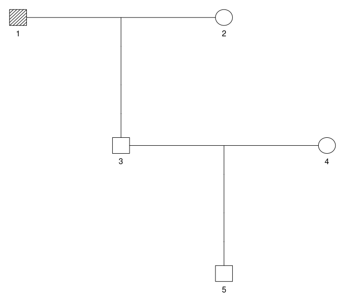
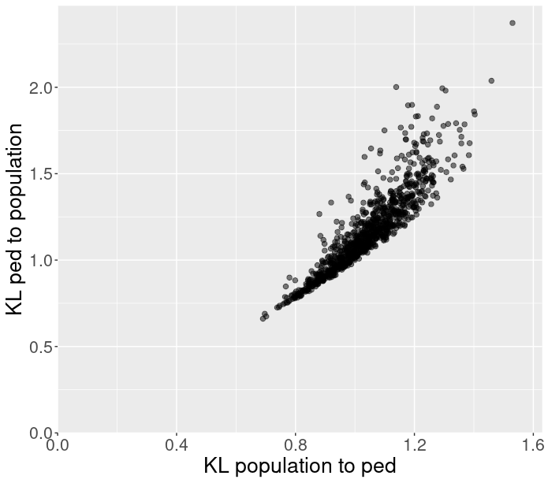
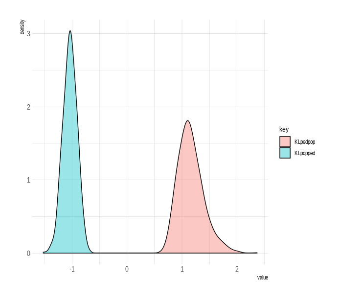

#  forensIT: Information Theory Tools for Forensic Analysis

The 'forensIT' package is a comprehensive statistical toolkit tailored for handling missing person cases. 
By leveraging information theory metrics, it enables accurate assessment of kinship, particularly when limited genetic evidence is available. 
With a focus on optimizing statistical power, 'forensIT' empowers investigators to effectively prioritize family members, enhancing the reliability and efficiency of missing person investigations. 

If you want to install forensicIT, please use:

``` r
install.packages("devtools")
library(devtools)
install_github("chernolabs/forensIT")
library(forensIT)
```

Using other packages
``` r
library(forrel)
library(mispitools)
library(dplyr)
library(ggplot2)
library(tidyr)
library(pedprobr)
```
Describe your issue very briefly here. Then show it with a minimal, self-contained example in the following R chunk.

``` r
#install.packages("forensIT")
#install.packages("devtoos")
#library(devtools)
#install_version("fbnet", "1.0.1")
```

``` r
library(pedtools)
library(mispitools)

```

``` r
seed <- 123457
freqs <- lapply(getfreqs(Argentina)[1:15], function(x) {x[x!=0]})
pedName <- 'ped5Ensemble'
fam  <- linearPed(2)
fam  <- addChildren(fam, father =  1, mother =  2)
fam  <- pedtools::setMarkers(fam, locusAttributes = freqs)
ped  <- profileSim(fam, N = 1, ids = c(6)  , numCores = 1,seed=seed)
QP   <- 5
plot(ped,marker=1:2, hatched = typedMembers(ped))
```

<!-- -->

``` r
testIDs <- 2
```

``` r
numSim <- 100
numCores <- 2
simME <- simMinimalEnsemble(ped,QP,testIDs,freqs=freqs,numCores=numCores)
#> ID: 2 Number of fbnet runs: 63   ( D21S11 )
#> 
#> Genotypes per marker to explore:
#>          2
#> D8S1179 12
#> D21S11  63
#> D7S820  14
#> CSF1PO  23
#> D3S1358 12
#> THO1    19
#> D13S317 21
#> D16S539 19
#> D2S1338 13
#> D19S433 25
#> VWA     25
#> TPOX    13
#> D18S51  25
#> D5S818  10
#> FGA     53
#> running testID: 2
```


``` r
head(simME[["lMatrixGenotype"]][[1]])
#>         [,1]    [,2]    [,3]      [,4]    [,5]    [,6]      [,7]     [,8]     
#> D8S1179 "14/14" "8/14"  "9/14"    "10/14" "11/14" "12/14"   "13/14"  "14/15"  
#> D21S11  "30/30" "30/31" "31/31"   "19/30" "24/30" "24.2/30" "25/30"  "25.2/30"
#> D7S820  "10/10" "6/10"  "7/10"    "8/10"  "9/10"  "9.1/10"  "10/11"  "10/12"  
#> CSF1PO  "11/11" "11/12" "12/12"   "6/11"  "7/11"  "8/11"    "8.3/11" "9/11"   
#> D3S1358 "14/14" "10/14" "11/14"   "12/14" "13/14" "14/15"   "14/16"  "14/17"  
#> THO1    "8/8"   "8/9.3" "9.3/9.3" "4/8"   "5/8"   "6/8"     "7/8"    "8/9"    
```

``` r
head(simME[["ITtable"]][["KL_bnet.pop"]])
#> [1] 0.05770006 0.04169475 0.04587450 0.55561772 0.40356996 0.30196013
```

``` r
lsimEnsemble  <- simTestIDMarkers(ped,testIDs,numSim=numSim,seed=seed)
lensembleIT   <- buildEnsembleITValues(lsimu=lsimEnsemble,ITtab=simME$ITtable,bFullIT = TRUE)
lensembleCPTs <- buildEnsembleCPTs(lsimu=lsimEnsemble,lminimalProbGenoMOI=simME$lprobGenoMOI)
```

``` r
head(lensembleCPTs[["2"]][["sample_1"]][["D8S1179"]])
#>        geno         pop        bnet    geno_conj
#> 10/10 10/10 0.004722438 0.001180610 1.298005e-05
#> 10/11 10/11 0.009960277 0.002490069 2.737672e-05
#> 10/12 10/12 0.019726763 0.004931691 5.422079e-05
#> 10/13 10/13 0.041844982 0.010461246 1.150147e-04
#> 10/14 10/14 0.030561158 0.059180290 6.506495e-04
#> 10/15 10/15 0.018873261 0.004718315 5.187486e-05
```

``` r
numSimLR <- 1000
for(iid in seq_along(lensembleCPTs)){
  mlr <- c()
  for(i in seq_along(lensembleCPTs[[iid]])){
    lprob <- lensembleCPTs[[iid]][[i]]
    resLR <- simLR(lprob,numSim = numSimLR,bplot=TRUE)
    mlr <- rbind(mlr,resLR$metrics)
  } 
}
```

``` r
id     <- c('2')
sample <- 1
lprobG <- lensembleCPTs[[id]][[sample]] 
averLR    <- simLR(lprobg_ped = lprobG,numSim = 10000,bplot = TRUE)
```

``` r
averLR$fig
```

<!-- -->

``` r
averLR$metrics
#>                  tp                  fp                  tn                  fn 
#>            "0.9349"            "0.0713"            "0.9287"            "0.0651" 
#>                 mcc                  f1            nH0peaks           muH0peaks 
#> "0.863616598870547" "0.932010766623467"             "10000"             "-1.99"
```

``` r
data <- as.data.frame(cbind(lensembleIT[["ensembleIT"]][["KL_bnet.pop"]], lensembleIT[["ensembleIT"]][["KL_pop.bnet"]]))
names(data) <- c("KLbnetpop", "KLpopbnet")
head(data)
#>   KLbnetpop KLpopbnet
#> 1  1.783723  1.991510
#> 2  1.849676  2.061288
#> 3  1.818713  2.035866
#> 4  1.983555  2.200366
#> 5  2.072932  2.344730
#> 6  1.801063  2.031608
```

``` r
p1 <- ggplot(data,aes(y=KLpopbnet,x=KLbnetpop,col=id)) +
  geom_point() + xlab("KL bnet pop") + ylab("KL pop bnet")
p1
```

<!-- -->


## Working with Elston-Stewart
Despite fonrensIT main functionalities work with fbnet, using the advantages of the Bayesian Network approach, it is also possible to work with Elston-Stewart algorithm. To this end, forensIT make use of the propr R packaga, part of pedsuite. In the following examples we show how to produce similar results obtained previously with the conditional probability table that comes from Elston-Stewart approach:

KL (dits units) per marker could be obtained with the following commands:
``` r
freqs = getfreqs(Argentina[1:15])
x = linearPed(2)
plot(x)
x = setMarkers(x, locusAttributes = freqs)
x = profileSim(x, N = 1, ids = 2)
perMarkerKLs(x,  freqs)
``` 

<!-- -->


KL (dits) distributions for a specific relative to be potentially incorporated to the pedigree could be obtained as follows:
``` r
y = linearPed(2)
x = setMarkers(y, locusAttributes = freqs)
res <- distKL(ped = x, missing = 5, relative = 1, cores = 10, frequency = freqs, numsims = 5)
res
``` 
    ##     KLpopped  KLpedpop
    ##    1.1708052 1.6985469
    ##    1.0524863 1.1335089
    ##    1.0738553 1.1462661
    ##    0.9431456 0.9980392
    ##    1.4592184 2.0374789
    ##    0.7972688 0.8059407
    ##    1.0690941 1.0794834
    ##    1.1146577 1.2404207
    ##    0.8978531 1.0942142
    ##    1.0621151 1.2631875


A scatterplot could be obtained with the following code:
``` r
plotKL(res)
``` 
<!-- -->

KL distributions presented in the same units (Log10(LR)). Note that this implies plotting -KL(pop to ped)
``` r
unidimKLplot(res)
``` 
<!-- -->
