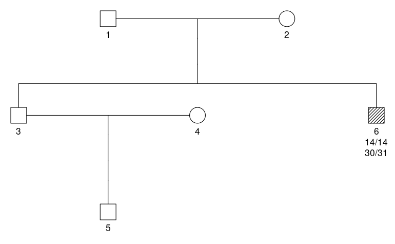
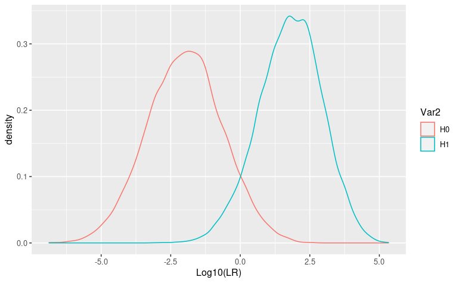

[](https://CRAN.R-project.org/package=forensIT)
[](https://cran.r-project.org/package=forensIT)


#  forensIT: Information Theory Tools for Forensic Analysis

The 'forensIT' package is a comprehensive statistical toolkit tailored for handling missing person cases. 
By leveraging information theory metrics, it enables accurate assessment of kinship, particularly when limited genetic evidence is available. 
With a focus on optimizing statistical power, 'forensIT' empowers investigators to effectively prioritize family members, enhancing the reliability and efficiency of missing person investigations. To cite foresIT please use the following reference:

  -  Marsico, Sibila, Escobar and Chernomoretz, 2023 (http://dx.doi.org/10.2139/ssrn.4531590)
  -  Marsico, Sibila, Escobar and Chernomoretz, 2024 (https://doi.org/10.1016/j.fsigen.2024.103025)

The following packages should be installed previously to install forensIT as follows:
Tip: some of the packages require development libraries that should be installed before. If you are using Linux, you can run the following line in your terminal: sudo apt-get install libharfbuzz-dev libfribidi-dev libfreetype6-dev libpng-dev libtiff5-dev libjpeg-dev libcairo2-dev

``` r
install.packages("fbnet")
install.packages("forrel")
install.packages("mispitools")
install.packages("pedtools")
install.packages("tidyverse")
install.packages("ggplot2")
install.packages("pedprobr")
```


To install forensIT please run the following code on your R command line:


``` r
install.packages("forensIT")
```

First, the "forensIT" package is installed, which enables forensic analysis and investigations using R. Next, the "devtools" package is installed to provide a range of tools for package manipulation. Lastly, the "fbnet" package is, and MUST BE, installed at version "1.0.1" using the install_version() function from "devtools". 


Also, you can install the version under development with the following code:
``` r
library(devtools)
install_github("chernolabs/forensIT")
```


In the provided code, several steps are taken to set up a simulation and visualization of a pedigree with marker information.

First, a random seed value of 123457 is set to ensure reproducibility of random processes in the code.

Next, the variable freqs is assigned the first 15 markers obtained by applying the getfreqs() function to the "Argentina" dataset. The lapply() function is used to filter out values that are not equal to zero.

Then, a linear pedigree named fam is created with 2 founders using the linearPed() function.

Additional individuals are added to the pedigree using the addChildren() function, specifying the father as 1 and the mother as 2.

The setMarkers() function from the pedtools package is used to assign locus attributes to the pedigree, using the frequencies specified in the freqs variable.

A simulated profile is generated using the profileSim() function, with the fam pedigree, generating 1 sample (N = 1), selecting individual ID 6, using 1 core for computation, and using the previously set seed.

The variable QP is assigned the value 5, representing the Query person.

Finally, a plot of the pedigree is generated using the plot() function, displaying markers 1 and 2, with hatching indicating typed members in the pedigree.


``` r
library(forensIT)
library(pedtools)
library(mispitools)
library(forrel)

seed <- 123457
freqs <- lapply(getfreqs(Argentina)[1:15], function(x) {x[x!=0]})
pedName <- 'ped5Ensemble'
fam  <- linearPed(2)
fam  <- addChildren(fam, father =  1, mother =  2)
fam  <- pedtools::setMarkers(fam, locusAttributes = freqs)
ped  <- profileSim(fam, N = 1, ids = c(6)  , numCores = 1,seed=seed)
QP   <- 5
plot(ped,marker=1:2, hatched = typedMembers(ped))
```

<!-- -->

# Obtaining the minimal genotype ensemble


The variable testIDs is assigned the value 2, representing the test individual(s) that will be included in the simulation.

The variable numSim is set to 100, indicating that 100 simulations will be performed.

The variable numCores is assigned the value 2, specifying that two cores will be used for computation.

The simMinimalEnsemble() function is then called with the parameters ped (the pedigree), QP (the query person), testIDs (relatives to be genotyped), freqs (the locus frequencies), and numCores. This function generates simulations of minimal ensembles of genotypes based on the provided pedigree and frequencies.

The results of the simulation are stored in the variable simME, which can be further analyzed.


``` r
library(fbnet)

testIDs <- 2
numSim <- 100
numCores <- 2
simME <- simMinimalEnsemble(ped,QP,testIDs,freqs=freqs,numCores=numCores)
#> ID: 2 Number of fbnet runs: 63   ( D21S11 )
#> 
#> Genotypes per marker to explore:
#>          2
#> D8S1179 12
#> D21S11  63
#> D7S820  14
#> CSF1PO  23
#> D3S1358 12
#> THO1    19
#> D13S317 21
#> D16S539 19
#> D2S1338 13
#> D19S433 25
#> VWA     25
#> TPOX    13
#> D18S51  25
#> D5S818  10
#> FGA     53
#> running testID: 2
```

head(simME[["lMatrixGenotype"]][[1]]) retrieves the first element of the "lMatrixGenotype" list within the "simME" object and displays the first few rows of the retrieved data.

``` r
head(simME[["lMatrixGenotype"]][[1]])
#>         [,1]    [,2]    [,3]      [,4]    [,5]    [,6]      [,7]     [,8]     
#> D8S1179 "14/14" "8/14"  "9/14"    "10/14" "11/14" "12/14"   "13/14"  "14/15"  
#> D21S11  "30/30" "30/31" "31/31"   "19/30" "24/30" "24.2/30" "25/30"  "25.2/30"
#> D7S820  "10/10" "6/10"  "7/10"    "8/10"  "9/10"  "9.1/10"  "10/11"  "10/12"  
#> CSF1PO  "11/11" "11/12" "12/12"   "6/11"  "7/11"  "8/11"    "8.3/11" "9/11"   
#> D3S1358 "14/14" "10/14" "11/14"   "12/14" "13/14" "14/15"   "14/16"  "14/17"  
#> THO1    "8/8"   "8/9.3" "9.3/9.3" "4/8"   "5/8"   "6/8"     "7/8"    "8/9"    
```

``` r
head(simME[["ITtable"]][["KL_bnet.pop"]])
#> [1] 0.05770006 0.04169475 0.04587450 0.55561772 0.40356996 0.30196013
```
# Calculating IT metrics

The function simTestIDMarkers() performs simulations of marker genotypes for the specified test individual(s) (testIDs) using the provided pedigree (ped). The number of simulations is determined by the numSim parameter.

The next code calculates the IT (information theory) values for the simulated ensemble using the function buildEnsembleITValues(). It takes the lsimu (simulated ensemble) and ITtab (IT table) as inputs. The bFullIT parameter is set to TRUE, indicating that the full IT values should be calculated.

Lastly, the code uses the function buildEnsembleCPTs() to construct the conditional probability tables (CPTs) for the simulated ensemble. It takes the lsimu (simulated ensemble) and lminimalProbGenoMOI (minimal probability of genotypes given modes of inheritance) from the simME object as inputs.

``` r
lsimEnsemble  <- simTestIDMarkers(ped,testIDs,numSim=numSim,seed=seed)
lensembleIT   <- buildEnsembleITValues(lsimu=lsimEnsemble,ITtab=simME$ITtable,bFullIT = TRUE)
lensembleCPTs <- buildEnsembleCPTs(lsimu=lsimEnsemble,lminimalProbGenoMOI=simME$lprobGenoMOI)
```


head(lensembleCPTs[["2"]][["sample_1"]][["D8S1179"]]) retrieves the conditional probability table (CPT) for the marker "D8S1179" in the simulated ensemble. It specifically accesses the CPT for "sample_1" of the test individual with ID 2.

``` r
head(lensembleCPTs[["2"]][["sample_1"]][["D8S1179"]])
#>        geno         pop        bnet    geno_conj
#> 10/10 10/10 0.004722438 0.001180610 1.298005e-05
#> 10/11 10/11 0.009960277 0.002490069 2.737672e-05
#> 10/12 10/12 0.019726763 0.004931691 5.422079e-05
#> 10/13 10/13 0.041844982 0.010461246 1.150147e-04
#> 10/14 10/14 0.030561158 0.059180290 6.506495e-04
#> 10/15 10/15 0.018873261 0.004718315 5.187486e-05
```

# LR distribution and performance


The following code starts setting numSimLR to 1000, indicating the number of simulations to be performed for the likelihood ratio (LR) calculations.

A nested loop is then used to iterate over the elements of lensembleCPTs. The outer loop iterates over the IDs (iid) of the simulated ensembles, while the inner loop iterates over the samples (i) within each ensemble.

Within the inner loop, the conditional probability table (lprob) is retrieved from lensembleCPTs for the corresponding ensemble and sample. The simLR() function is then called with the lprob as input, along with the specified number of simulations (numSimLR) and the bplot parameter set to TRUE to enable plotting of the LR results.

The LR obtained from each simulation are stored in the mlr variable using the rbind() function, appending the results for each sample within an ensemble.

``` r
numSimLR <- 1000
for(iid in seq_along(lensembleCPTs)){
  mlr <- c()
  for(i in seq_along(lensembleCPTs[[iid]])){
    lprob <- lensembleCPTs[[iid]][[i]]
    resLR <- simLR(lprob,numSim = numSimLR,bplot=TRUE)
    mlr <- rbind(mlr,resLR$metrics)
  } 
}
```

The variable id is defined as a character vector containing the ID '2', and the variable sample is set to 1, indicating the specific sample of interest. The sample represent a specific MP's relative genotype. For that genotype, LR distributions could be computed.

Next, the conditional probability table (lprobG) is extracted from the lensembleCPTs object, using the id and sample variables to access the corresponding elements.

Then, the simLR() function is called with the lprobg_ped parameter set to lprobG, indicating the conditional probability table for the sample of interest. The numSim parameter is set to 10,000, specifying the number of simulations to perform. Additionally, the bplot parameter is set to TRUE, enabling the plotting of LR results.

The output of this function call is assigned to the averLR variable, which contains the average LR metrics calculated from the simulations.

``` r
id     <- c('2')
sample <- 1
lprobG <- lensembleCPTs[[id]][[sample]] 
averLR    <- simLR(lprobg_ped = lprobG,numSim = 10000,bplot = TRUE)
```

``` r
averLR$fig
```

<!-- -->


Also, performance metrics could be obtained for this specific genotype.

``` r
averLR$metrics
#>                  tp                  fp                  tn                  fn 
#>            "0.9349"            "0.0713"            "0.9287"            "0.0651" 
#>                 mcc                  f1            nH0peaks           muH0peaks 
#> "0.863616598870547" "0.932010766623467"             "10000"             "-1.99"
```


# KL-KL plot

Overall, the following code  organizes the KL (Kullback-Leibler) divergence values obtained from the lensembleIT object into a data frame and displays the first few rows of the resulting data frame.


``` r
data <- as.data.frame(cbind(lensembleIT[["ensembleIT"]][["KL_bnet.pop"]], lensembleIT[["ensembleIT"]][["KL_pop.bnet"]]))
names(data) <- c("KLbnetpop", "KLpopbnet")
head(data)
#>   KLbnetpop KLpopbnet
#> 1  1.783723  1.991510
#> 2  1.849676  2.061288
#> 3  1.818713  2.035866
#> 4  1.983555  2.200366
#> 5  2.072932  2.344730
#> 6  1.801063  2.031608
```

The following step creates a scatter plot using the "KLbnetpop" and "KLpopbnet" columns from the data data frame, where the points are colored based on the "id" column. The x-axis and y-axis labels are specified, and the resulting plot is shown. There are 100 data points, representing KL values for each specific genotype.

``` r
library(ggplot2)

p1 <- ggplot(data,aes(y=KLpopbnet,x=KLbnetpop,col=id)) +
  geom_point() + xlab("KL bnet pop") + ylab("KL pop bnet")
p1
```

<!-- -->


## Working with Elston-Stewart
Despite fonrensIT main functionalities work with fbnet, using the advantages of the Bayesian Network approach, it is also possible to work with Elston-Stewart algorithm. To this end, conditional probability tables could be obtained from propr R package, part of pedsuite: https://magnusdv.github.io/pedsuite/
